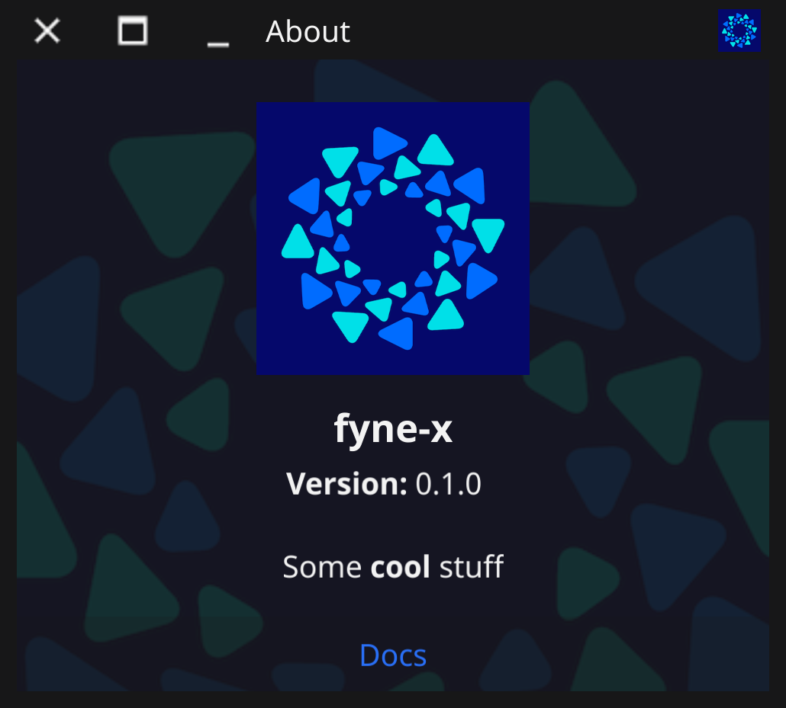

<p align="center">
  <a href="https://pkg.go.dev/fyne.io/x/fyne" title="Go API Reference" rel="nofollow"></a>
  <a href='http://gophers.slack.com/messages/fyne'></a>
  <br />
  <a href="https://goreportcard.com/report/fyne.io/x/fyne"></a>
  <a href="https://github.com/fyne-io/fyne-x/actions"></a>
  <a href='https://coveralls.io/github/fyne-io/fyne-x?branch=master'></a>
</p>

# About

This repository holds community extensions for the [Fyne](https://fyne.io) toolkit.

This is in early development and more information will appear soon.

## Layouts

Community contributed layouts.

`import "fyne.io/x/fyne/layout"`

### Responsive Layout

The responsive layout provides a "bootstrap like" configuration to automatically make containers and canvas reponsive to the window width. It reacts to  the window size to resize and move the elements. The sizes are configured with a ratio of the **container** width (`0.5` is 50% of the container size).

The responsive layout follow the [bootstrap size breakpoints](https://getbootstrap.com/docs/4.0/layout/overview/#responsive-breakpoints):

- extra small for window width <= 576px
- small for window width <= 768
- medium for window width <= 992
- large for window width <= 1200
- extra large for window width > 1200

<p align="center" class="align:center;margin:auto">
    
</p>

To use a responsive layout:

```go
layout := NewResponsiveLayout(fyne.CanvasObject...)
```

Optionally, Each canvas object can be encapsulated with `Responsive()` function to give the sizes:

```go
layout := NewResponsiveLayout(
    Responsive(object1),            // all sizes to 100%
    Responsive(object2, 0.5, 0.75), // small to 50%, medium to 75%, all others to 100% 
)
```


## Widgets

This package contains a collection of community-contributed widgets for the [Fyne](https://fyne.io/) 
toolkit. The code here is intended to be production ready, but may be lacking
some desirable functional features. If you have suggestions for changes to 
existing functionality or addition of new functionality, please look at the existing
issues in the repository to see if your idea is already on the table. If it is not,
feel free to open an issue. 

This collection should be considered a work in progress. When changes are made,
serious consideration will be given to backward compatibility, but compatibility
is not guaranteed. 

`import "fyne.io/x/fyne/widget"`

### Animated Gif

A widget that will run animated gifs.

<p align="center" class="align:center;margin:auto" markdown="1">

</p>

```go
gif, err := NewAnimatedGif(storage.NewFileURI("./testdata/gif/earth.gif"))
gif.Start()
```

### Calendar

A date picker which returns a [time](https://pkg.go.dev/time) object with the selected date.

<p align="center" class="align:center;margin:auto">


</p>

  

To use create a new calendar with a given time and a callback function:

```go

calendar := widget.NewCalendar(time.Now(), onSelected, cellSize, padding)

```
[Demo](./cmd/calendar_demo/main.go) available for example usage

### DiagramWidget

The DiagramWidget provides a drawing area within which a diagram can be created. The diagram itself is a collection of 
DiagramElement widgets (an interface). There are two types of DiagramElements: DiagramNode widgets and DiagramLink widgets. 
DiagramNode widgets are thin wrappers around a user-supplied CanvasObject.
Any valid CanvasObject can be used. DiagramLinks are line-based connections between DiagramElements.
Note that links can connect to other links as well as nodes.

While some provisions have been made for automatic layout, layouts are for the convenience
of the author and are on-demand only. The design intent is that users will place the diagram elements for human readability. 

DiagramElements are managed by the DiagramWidget from a layout perspective. DiagramNodes have no size
constraints imposed by the DiagramWidget and can be placed anywhere. DiagramLinks connect 
DiagramElements. The DiagramWidget keeps track of the DiagramElements to which each DiagramLink 
is connected and calls the Refresh() method on the link when the connected diagram element is moved 
or resized. 

* [demo](./cmd/diagramdemo/main.go)
* [More Detail](./widget/diagramwidget/README.md)

<p align="center" markdown="1" style="max-width: 100%">
  
</p>


### FileTree

An extension of widget.Tree for displaying a file system hierarchy.

```go
tree := widget.NewFileTree(storage.NewFileURI("~")) // Start from home directory
tree.Filter = storage.NewExtensionFileFilter([]string{".txt"}) // Filter files
tree.Sorter = func(u1, u2 fyne.URI) bool {
    return u1.String() < u2.String() // Sort alphabetically
}
```

<p align="center" markdown="1" style="max-width: 100%">
  
</p>

### CompletionEntry

An extension of widget.Entry for displaying a popup menu for completion. The "up" and "down" keys on the keyboard are used to navigate through the menu, the "Enter" key is used to confirm the selection. The options can also be selected with the mouse. The "Escape" key closes the selection list.

```go
entry := widget.NewCompletionEntry([]string{})

// When the use typed text, complete the list.
entry.OnChanged = func(s string) {
    // completion start for text length >= 3
    if len(s) < 3 {
        entry.HideCompletion()
        return
    }

    // Make a search on wikipedia
    resp, err := http.Get(
        "https://en.wikipedia.org/w/api.php?action=opensearch&search=" + entry.Text,
    )
    if err != nil {
        entry.HideCompletion()
        return
    }

    // Get the list of possible completion
    var results [][]string
    json.NewDecoder(resp.Body).Decode(&results)

    // no results
    if len(results) == 0 {
        entry.HideCompletion()
        return
    }

    // then show them
    entry.SetOptions(results[1])
    entry.ShowCompletion()
}
```

<p align="center" markdown="1" style="max-width: 100%">
  
</p>

### 7-Segment ("Hex") Display

A skeuomorphic widget simulating a 7-segment "hex" display. Supports setting
digits by value, as well as directly controlling which segments are on or
off.

Check out the [demo](./cmd/hexwidget_demo/main.go) for an example of usage.


```go
h := widget.NewHexWidget()
// show the value 'F' on the display
h.Set(0xf)
```

### Map

An OpenStreetMap widget that can the user can pan and zoom.
To use this in your app and be compliant with their requirements you may need to request
permission to embed in your specific software.

```go
m := NewMap()
```


### TwoStateToolbarAction

A TwoStateToolbarAction displays one of two icons based on the stored state. It is similar
to a regular ToolbarAction except that the icon and state are toggled each time the toolbar
action is activated. The current (new) state is passed to the `onActivated` function.

One potential use of this toolbar action is displaying the MediaPlayIcon when a media 
file is not being played, and the MediaPauseIcon or MediaStopIcon when a media file is 
being played. A second use may be seen in an application where a left or right panel is 
displayed or not. For example, show the left panel open icon when the left panel is 
closed, and the left panel close icon when the panel is open.


```go
action := NewTwoStateToolBar(theme.MediaPlayIcon(), 
    theme.MediaPauseIcon(), 
    func(on bool) {
        // Do something with state. For example, if on is true, start playback.
    })
```

* [Demo App](cmd/twostatetoolbaraction_demo/main.go)

### NumericalEntry

A NumericalEntry is an Entry widget that accepts the inputting of numbers containing
Arabic digits (0 through 9), as well as the minus sign, the radix separator (AKA decimal point,
the separator
character between the integer and fractional portions of the number), and the thousands separator
that are valid for the system's current locale. For example, for the 'en-US' locale, the minus sign
is the Unicode hyphen-minus (0x2d), the radix separator is the full stop (AKA period, 0x2e), and the
thousands separator is the comma (0x2c). For the 'fr-FR' locale, the minus sign is hyphen-minus
(0x2d), the radix separator is the comma, and the thousands separator is the non-breaking space
(0xa0). For the 'et-EE' locale, the minus sign is the mathematical minus (0x2212), the radix
separator is the comma (0x2c), and the thousands separator is the non-breaking space (0xa0).

Here is an image of a NumericalEntry containing the number -12345.6789 for the "en-GB"
locale:


and here is an image showing an invalid value (there are two radix separators: '.'):


#### Acceptable Characters

##### Digits

Go prints all numbers using Arabic digits (0 through 9), even for those locales that have
alternative number characters. Therefore, the NumericalEntry widget only accepts
Arabic digits as digits.

###### RTL versus LTR

The standard practice is to display all numbers left to right (LTR), even for locales and
languages that are written right to left (RTL). Go follows this standard, as does the
NumericalEntry widget.

##### Minus Sign

There are two minus signs that are used in different locales: the hyphen-minus (0x2d) and
the mathematical minus (0x2212). NumericalEntry widgets accept both of these
characters, and, as required, converts the non-locale-specific character to the locale-specific
one. A minus sign can be input only in the first character position in the widget.

If the NumericalEntry does not accept negative numbers (the AllowNegative field is
false), then the minus sign is simply thrown away and not is displayed.

##### Radix Separator

Each locale uses either the full stop ('.') or the comma (',') as the radix separator.
In some locales, the other symbol may or may not be used as the thousands separator.
NumericalEntry widgets accept only the locale-specific radix separator as the
radix separator.

Radix separators are ignored (not displayed) if the NumericalEntry does not accept
floating point numbers (the AllowFloat field is false).

##### Thousands Separator

The character is called a thousands separator because it is typically used to separate sets
of three digits. For example, in the 'en-US' locale, for the number '-1234567.8907' in the
following code snippet:

```go
	lang, _ := language.Parse("en-US")
	p := message.NewPrinter(lang)
	numStr := p.Sprintf("%f", -1234567.8907)
```

numStr would contain the string `1,234,567.8907`. 

Even though it is called a thousands separator, not all locales separate every three digits.
For example, Korean and Indian locales place a separator at three digits to the left of the
radix separator, but every two digits thereafter. Therefore, thousands separators are allowed
anywhere in the NumericalEntry widget, excepts as specified below in the Validation section.
The character will still be displayed in the widget except as follows:

* A thousands separator cannot be the first character in the entry.
* A thousands separator cannot immediately follow a minus sign.

In each of these cases, the character is simply deleted when an attempt is made to enter it.

Each locale supports only one thousands separator, but different keyboards may not have that
specific character. For example, in all locales for Switzerland and Liechtenstein, Go outputs 
the right single quotation mark (0x2019) as the thousands separator. While this character is
available on all German keyboards including the Swiss German keyboard, it is not available on
the US and UK keyboards. In many applications, the apostrophe is  accepted instead . Because 
of this, an alternative character is also provided for each of the
possible thousands separators except comma.

* space (0x20) and non-breaking space (0xa0).
* apostrophe (0x27) and right single quotation mark (0x2019).

Each of these characters is converted to the locale's specific thousands
separator and displayed in the widget.

#### Validation

Except as discussed above, characters are accepted and displayed in the widget. Validation is
performed each time one or more characters is entered into the widget via the keyboard, via a
call to the `SetText` or `Append` methods, or via paste from the clipboard.

Here are the specific conditions that result in validation failure:

| Condition                                     | Example Input | Valid? |
| --------------------------------------------- | ------------- | ------ |
| Minus sign not at the start                   | `1-23`        | No     |
| More than one radix separator                 | `1.2.3`       | No     |
| Thousands separator as first character       | `,123`        | No     |
| Thousands separator after minus sign          | `-,123`       | No     |
| Two thousands separators next to each other | `1,,234`      | No     |
| Thousands separator next to radix separator | `1,.23`       | No     |
| Valid input (en-US locale)                    | `-1,234.56`   | Yes    |

Validation failure has different results depending on how input is being done. For example:

* For text entered via `SetText`, characters other than digits, the locale's radix separator, and
locale's thousands separator, minus sign, and their alternatives are ignored. Minus signs not in the first position of the text are thrown away.
* For text entered via `Append`, if there is already text in the entry, then the minus sign in the
append text is thrown away, and all other characters are handled as for `SetText`.
* For clipboard paste actions, if the cursor position is 0 and the first character in the entry is
a minus sign, then no clipboard characters are pasted. If the cursor position is not 0, then the
characters are handled like for `Append`.
* For keyboard input of characters:
  * If the cursor position is 0 and the first character in the entry is a minus sign, then the
  character is thrown away.
  * If the cursor position is not 0, then minus signs are thrown away. Other valid characters are
  displayed, and the text is validated as above.
  
If the text in the widget is valid, then the
checkmark as shown in the first image, above is displayed always. If the text is invalid and the
widget has focus, the checkmark is not displayed. If the text is invalid and the widget does
not have focus, the widget is displayed as in the second image above.

[Demo](./cmd/numericalentry_demo/main.go)

## Dialogs

### About

A cool parallax about dialog that pulls data from the app metadata and includes
some markup content and links at the bottom of the window/dialog.

```go
	docURL, _ := url.Parse("https://docs.fyne.io")
	links := []*widget.Hyperlink{
		widget.NewHyperlink("Docs", docURL),
	}
	dialog.ShowAboutWindow("Some **cool** stuff", links, a)
```



## Data Binding

Community contributed data sources for binding.

`import fyne.io/x/fyne/data/binding`

### WebString

A `WebSocketString` binding creates a `String` data binding to the specified web socket URL.
Each time a message is read the value will be converted to a `string` and set on the binding.
It is also `Closable` so you should be sure to call `Close()` once you are completed using it.

```go
s, err := binding.NewWebSocketString("wss://demo.piesocket.com/v3/channel_1?api_key=oCdCMcMPQpbvNjUIzqtvF1d2X2okWpDQj4AwARJuAgtjhzKxVEjQU6IdCjwm&notify_self")
l := widget.NewLabelWithData(s)
```

The code above uses a test web sockets server from "PieSocket", you can run the code above
and go to [their test page](https://www.piesocket.com/websocket-tester) to send messages.
The widget will automatically update to the latest data sent through the socket.

### MqttString

A `MqttString` binding creates a `String` data binding to the specified _topic_ associated with
the specified **MQTT** client connection. Each time a message is received the value will be converted
to a `string` and set on the binding. Each time the value is edited, it will be sent back over
**MQTT** on the specified _topic_. It is also a `Closer` so you should be sure to call `Close`
once you are completed using it to disconnect the _topic_ handler from the **MQTT** client connection.

```go
opts := mqtt.NewClientOptions()
opts.AddBroker("tcp://broker.emqx.io:1883")
opts.SetClientID("fyne_demo")
client := mqtt.NewClient(opts)

token := client.Connect()
token.Wait()
if err := token.Error(); err != nil {
    // Handle connection error
}

s, err := binding.NewMqttString(client, "fyne.io/x/string")
```

## Data Validation

Community contributed validators.

`import fyne.io/x/fyne/data/validation`

### Password

A validator for validating passwords. Uses https://github.com/wagslane/go-password-validator
for validation using an entropy system.

```go
pw := validation.NewPassword(70) // Minimum password entropy allowed defined as 70.
```

## Themes

### Adwaita

Adwaita is the theme used in new the versions of KDE and Gnome (and derivatives) on GNU/Linux.
This theme proposes a color-schme taken from the Adwaita scpecification.

Use it with:

```go
import "fyne.io/x/fyne/theme"
//...

app := app.New()
app.Settings().SetTheme(theme.AdwaitaTheme())
```


