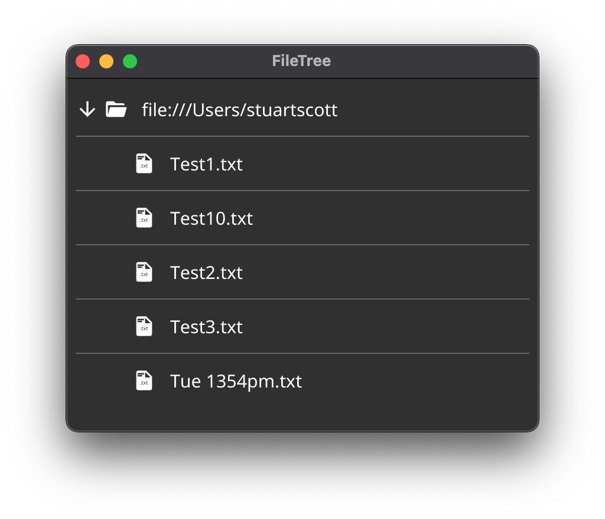

<p align="center">
  <a href="https://pkg.go.dev/fyne.io/fyne-x?tab=doc" title="Go API Reference" rel="nofollow"></a>
  <a href='http://gophers.slack.com/messages/fyne'></a>
  <br />
  <a href="https://goreportcard.com/report/fyne.io/x/fyne"></a>
  <a href="https://github.com/fyne-io/fyne-x/actions"></a>
  <a href='https://coveralls.io/github/fyne-io/fyne-x?branch=master'></a>
</p>

# About

This repository holds community extensions for the [Fyne](https://fyne.io) toolkit.

This is in early development and more information will appear soon.

## Layouts

Community contributed layouts.

`import fyne.io/x/fyne/layout`

## Widgets

Community contributed widgets.

`import fyne.io/x/fyne/widget`

### Animated Gif

A widget that will run animated gifs.

```go
gif, err := NewAnimatedGif(storage.NewFileURI("./testdata/gif/earth.gif"))
gif.Start()
```

### FileTree

An extension of widget.Tree for displaying a file system hierarchy.

```go
tree := widget.NewFileTree(storage.NewFileURI("~")) // Start from home directory
tree.Filter = storage.NewExtensionFileFilter([]string{".txt"}) // Filter files
tree.Sorter = func(u1, u2 fyne.URI) bool {
    return u1.String() < u2.String() // Sort alphabetically
}
```

<p align="center" markdown="1" style="max-width: 100%">
  
</p>

### CompletionEntry

An extension of widget.Entry for displaying a popup menu for completion. Keyboard keys can be used to navigate (up and down) and select the option to set to the Entry (Enter key) - the mouse can be used too.

```go
entry := widget.NewCompletionEntry([]string{})

// When the use typed text, complete the list.
entry.OnChanged = func(s string) {
    if len(s) < 3 {
        // do not make completion if string length is too short.
        entry.HideCompletion()
        return
    }

    // make a search on wikipedia
    resp, err := http.Get(
        fmt.Sprintf("https://en.wikipedia.org/w/api.php?action=opensearch&search=%s", entry.Text),
    )
    if err != nil {
        entry.HideCompletion()
    } else {
        // Get the list of possible completion
        results := make([][]interface{}, 0)
        dec := json.NewDecoder(resp.Body)
        dec.Decode(&results)

        // preapre the list
        items := make([]string, len(results[1]))
        for i, result := range results[1] {
            items[i] = result.(string)
        }

        // then show them
        entry.SetOptions(items)
        entry.ShowCompletion()
    }
}
```

<p align="center" markdown="1" style="max-width: 100%">
  
</p>

