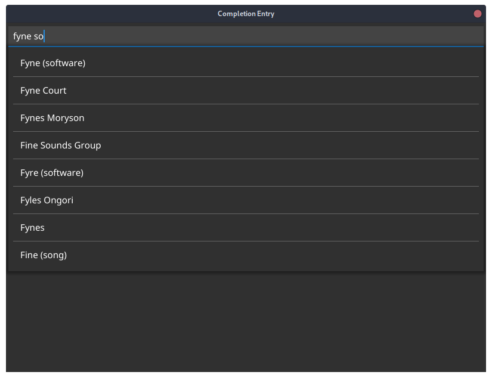

<p align="center">
  <a href="https://pkg.go.dev/fyne.io/x/fyne" title="Go API Reference" rel="nofollow"></a>
  <a href='http://gophers.slack.com/messages/fyne'></a>
  <br />
  <a href="https://goreportcard.com/report/fyne.io/x/fyne"></a>
  <a href="https://github.com/fyne-io/fyne-x/actions"></a>
  <a href='https://coveralls.io/github/fyne-io/fyne-x?branch=master'></a>
</p>

# About

This repository holds community extensions for the [Fyne](https://fyne.io) toolkit.

This is in early development and more information will appear soon.

# Layouts

Community contributed layouts.

`import "fyne.io/x/fyne/layout"`

## Responsive Layout

The responsive layout provides a "bootstrap like" configuration to automatically make containers and canvas reponsive to the window width. It reacts to  the window size to resize and move the elements. The sizes are configured with a ratio of the **container** width (`0.5` is 50% of the container size).

The responsive layout follow the [bootstrap size breakpoints](https://getbootstrap.com/docs/4.0/layout/overview/#responsive-breakpoints):

- extra small for window width <= 576px
- small for window width <= 768
- medium for window width <= 992
- large for window width <= 1200
- extra large for windo width > 1200

<p align="center" class="align:center;margin:auto">
    
</p>

To use a responsive layout:

```go
layout := NewResponsiveLayout(fyne.CanvasObject...)
```

Optionally, Each canvas object can be encapsulated with `Responsive()` function to give the sizes:

```go
layout := NewResponsiveLayout(
    Responsive(object1),            // all sizes to 100%
    Responsive(object2, 0.5, 0.75), // small to 50%, medium to 75%, all others to 100% 
)
```


# Widgets

Community contributed widgets.

`import "fyne.io/x/fyne/widget"`

## Animated Gif

A widget that will run animated gifs.

```go
gif, err := NewAnimatedGif(storage.NewFileURI("./testdata/gif/earth.gif"))
gif.Start()
```

## Calendar

A date picker which returns a [time](https://pkg.go.dev/time) object with the selected date.

<p  align="center"  class="align:center;margin:auto">


</p>

  

To use create a new calendar with a given time and a callback function:

```go

calendar := widget.NewCalendar(time.Now(), onSelected, cellSize, padding)

```
[Demo](./cmd/hexwidget_demo/main.go) available for example usage

## DiagramWidget

This package contains a collection of widgets for the [Fyne](https://fyne.io/) 
toolkit. The code here is intended to be production ready, but may be lacking
some desirable functional features. If you have suggestions for changes to 
existing functionality or addition of new functionality, please look at the existing
issues in the repository to see if your idea is already on the table. If it is not,
feel free to open an issue. 

This collection should be considered a work in progress. When changes are made,
serious consideration will be given to backward compatibility, but compatibility
is not guaranteed. 

The DiagramWidget itself is intended to be incorporated into a Fyne application. It provides a
drawing area within which a diagram can be created. The diagram itself is a collection of 
DiagramElement widgets (an interface). There are two types of DiagramElements: DiagramNode widgets and DiagramLink widgets. DiagramNode widgets are thin wrappers around a user-supplied CanvasObject.
Any valid CanvasObject can be used. DiagramLinks are line-based connections between DiagramElements.
Note that links can connect to other links as well as nodes.

While some provisions have been made for automatic layout, layouts are for the convenience
of the author and are on-demand only. The design intent is that users will place the diagram elements for human readability. 

DiagramElements are essentially self-managed from a layout perspective. DiagramNodes have no size
constraints imposed by the DiagramWidget and can be placed anywhere. DiagramLinks connect 
DiagramElements. The DiagramWidget keeps track of the DiagramElements to which each DiagramLink 
is connected and calls the Refresh() method on the link when the connected diagram element is moved 
or resized. 

* [demo](../../cmd/diagramdemo/main.go)

<p align="center" markdown="1" style="max-width: 100%">
  
</p>

**DiagramElement Interface**

A DiagramElement is the base interface for any element of the diagram being managed by the 
DiagramWidget. It provides a common interface for DiagramNode and DiagramLink widgets. The DiagramElement
interface provides operations for retrieving the DiagramWidget, the ID of the DiagramElement, and
for showing and hiding the handles that are used for graphically manipulating the diagram element.
The specifics of what handles do are different for nodes and links - these are described below in the
sections for their respective widgets.

**DiagramNode Widget**

The DiagramNode widget is a wrapper around a user-supplied CanvasObject. In addition to the user-supplied
CanvasObject, the node displays a border and, when selected, handles at the corners and edge mid-points that can be used to manipulate the size of the node. The node can be selected and dragged to a new position with a mouse by clicking in the border area around the canvas object. 

**DiagramLink Widget**

The DiagramLink widget provides a directed line-based connection between two DiagramElements. 
The link is defined in terms of LinkPoints that are connected by LinkSegments (both of which
are widgets in their own right). The link maintains an array of points, with the point at index
[0] being the point at which the link connects to the source DiagramElement and the point at the 
last index being the point at which the link connects to the target DiagramElement. The link also
maintains an array of line segments, with the segment at index [0] connecting points [0] and [1], 
the segment at index [1] connecting the points [1] and [2], etc. The current implementation only
has a single segment, but interfaces will be added shortly to enable the addition and removal of
points and segments.

Many visual languages (formalized diagrams) utilize graphical decorations on lines. The link
provides the ability to add an arbitrary number of graphic decorations at three points along 
the link: the source end, the target end, and the midpoint. Decorations are stacked in the order
they are added at the indicated point. The location of the source and target points is obvious,
but the midpoint bears some discussion. If there is only one line segment, the midpoint is the
midpoint of this segment. If there is more than one line segment, the "midpoint" is defined to
be the next to last point in the array of points. For a two-segment link, this will be the point
at which the two segments join. For a multi-segment link, this will be the point at which the 
next-to-last and last segments join.

Also common in visual languages are textual annotations associated with either the link as a whole 
or to the ends of the link. For this purpose, the link allows the association of one or more 
AnchoredText widgets with each of the reference points on the link: source, target, and midpoint.
These widgets keep track of their position relative to the link's reference points. They can 
be moved interactively with the mouse to a new position. When the reference point on the link
moves, the anchored text will also move, maintaining its relative position. 

Users do not create AnchoredText widgets directly: the link itself creates and manages them. 
the user calls Add\<position\>AnchoredText(key, text) to add an anchored text. The key is expected
to be unique at the position and can be used to update the text later. The AnchoredText can also
be directly edited in the diagram.  

When a link connects to another link, it connects at the midpoint of the source or target link.

## FileTree

An extension of widget.Tree for displaying a file system hierarchy.

```go
tree := widget.NewFileTree(storage.NewFileURI("~")) // Start from home directory
tree.Filter = storage.NewExtensionFileFilter([]string{".txt"}) // Filter files
tree.Sorter = func(u1, u2 fyne.URI) bool {
    return u1.String() < u2.String() // Sort alphabetically
}
```

<p align="center" markdown="1" style="max-width: 100%">
  
</p>

## CompletionEntry

An extension of widget.Entry for displaying a popup menu for completion. The "up" and "down" keys on the keyboard are used to navigate through the menu, the "Enter" key is used to confirm the selection. The options can also be selected with the mouse. The "Escape" key closes the selection list.

```go
entry := widget.NewCompletionEntry([]string{})

// When the use typed text, complete the list.
entry.OnChanged = func(s string) {
    // completion start for text length >= 3
    if len(s) < 3 {
        entry.HideCompletion()
        return
    }

    // Make a search on wikipedia
    resp, err := http.Get(
        "https://en.wikipedia.org/w/api.php?action=opensearch&search=" + entry.Text,
    )
    if err != nil {
        entry.HideCompletion()
        return
    }

    // Get the list of possible completion
    var results [][]string
    json.NewDecoder(resp.Body).Decode(&results)

    // no results
    if len(results) == 0 {
        entry.HideCompletion()
        return
    }

    // then show them
    entry.SetOptions(results[1])
    entry.ShowCompletion()
}
```

<p align="center" markdown="1" style="max-width: 100%">
  
</p>

## 7-Segment ("Hex") Display

A skeuomorphic widget simulating a 7-segment "hex" display. Supports setting
digits by value, as well as directly controlling which segments are on or
off.

Check out the [demo](./cmd/hexwidget_demo/main.go) for an example of usage.


```go
h := widget.NewHexWidget()
// show the value 'F' on the display
h.Set(0xf)
```

## Map

An OpenStreetMap widget that can the user can pan and zoom.
To use this in your app and be compliant with their requirements you may need to request
permission to embed in your specific software.

```go
m := NewMap()
```


# Data Binding

Community contributed data sources for binding.

`import fyne.io/x/fyne/data/binding`

## WebString

A `WebSocketString` binding creates a `String` data binding to the specified web socket URL.
Each time a message is read the value will be converted to a `string` and set on the binding.
It is also `Closable` so you should be sure to call `Close()` once you are completed using it.

```go
s, err := binding.NewWebSocketString("wss://demo.piesocket.com/v3/channel_1?api_key=oCdCMcMPQpbvNjUIzqtvF1d2X2okWpDQj4AwARJuAgtjhzKxVEjQU6IdCjwm&notify_self")
l := widget.NewLabelWithData(s)
```

The code above uses a test web sockets server from "PieSocket", you can run the code above
and go to [their test page](https://www.piesocket.com/websocket-tester) to send messages.
The widget will automatically update to the latest data sent through the socket.

## MqttString

A `MqttString` binding creates a `String` data binding to the specified _topic_ associated with
the specified **MQTT** client connection. Each time a message is received the value will be converted
to a `string` and set on the binding. Each time the value is edited, it will be sent back over
**MQTT** on the specified _topic_. It is also a `Closer` so you should be sure to call `Close`
once you are completed using it to disconnect the _topic_ handler from the **MQTT** client connection.

```go
opts := mqtt.NewClientOptions()
opts.AddBroker("tcp://broker.emqx.io:1883")
opts.SetClientID("fyne_demo")
client := mqtt.NewClient(opts)

token := client.Connect()
token.Wait()
if err := token.Error(); err != nil {
    // Handle connection error
}

s, err := binding.NewMqttString(client, "fyne.io/x/string")
```

# Data Validation

Community contributed validators.

`import fyne.io/x/fyne/data/validation`

## Password

A validator for validating passwords. Uses https://github.com/wagslane/go-password-validator
for validation using an entropy system.

```go
pw := validation.NewPassword(70) // Minimum password entropy allowed defined as 70.
```

