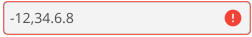

# NumericalEntry Widget

A NumericalEntry widget is an Entry widget that accepts the inputting of numbers containing
Arabic digits (0 through 9), as well as the minus sign, the radix separator (AKA decimal point,
the separator
character between the integer and fractional portions of the number), and the thousands separator
that are valid for the system's current locale. For example, for the 'en-US' locale, the minus sign
is the Unicode hyphen-minus (0x2d), the radix separator is the full stop (AKA period, 0x2e), and the
thousands separator is the comma (0x2c). For the 'fr-FR' locale, the minus sign is hyphen-minus
(0x2d), the radix separator is the comma, and the thousands separator is the non-breaking space
(0xa0). For the 'et-EE' locale, the minus sign is the mathematical minus (0x2212), the radix
separator is the comma (0x2c), and the thousands separator is the non-breaking space (0xa0).

Here is an image of a NumericalEntry containing the number -12345.6789 for the "en-GB"
locale:


and here is an image showing an invalid value (there are two radix separators: '.'):



## Acceptable Characters

### Digits

Go prints all numbers using Arabic digits (0 through 9), even for those locales that have
alternative number characters. Therefore, the NumericalEntry widget only accepts
Arabic digits as digits.

#### RTL versus LTR

The standard practice is to display all numbers left to right (LTR), even for locales and
languages that are written right to left (RTL). Go follows this standard, as does the
NumericalEntry widget.

### Minus Sign

There are two minus signs that are used in different locales: the hyphen-minus (0x2d) and
the mathematical minus (0x2212). NumericalEntry widgets accept both of these
characters, and, as required, converts the non-locale-specific character to the locale-specific
one. A minus sign can be input only in the first character position in the widget.

If the NumericalEntry does not accept negative numbers (the AllowNegative field is
false), then the minus sign is simply thrown away and not is displayed.

### Radix Separator

Each locale uses either the full stop ('.') or the comma (',') as the radix separator.
In some locales, the other symbol may or may not be used as the thousands separator.
NumericalEntry widgets accept only the locale-specific radix separator as the
radix separator.

Radix separators are ignored (not displayed) if the NumericalEntry does not accept
floating point numbers (the AllowFloat field is false).

### Thousands Separator

The character is called a thousands separator because it is typically used to separate sets
of three digits. For example, in the 'en-US' locale, for the number '-1234567.8907' in the
following code snippet:

```go
	lang, _ := language.Parse("en-US")
	p := message.NewPrinter(lang)
	numStr := p.Sprintf("%f", -1234567.8907)
```

numStr would contain the string `1,234,567.8907`. 

Even though it is called a thousands separator, not all locales separate every three digits.
For example, Korean and Indian locales place a separator at three digits to the left of the
radix separator, but every two digits thereafter. Therefore, thousands separators are allowed
anywhere in the NumericalEntry widget, excepts as specified below in the Validation section.
The character will still be displayed in the widget except as follows:

* A thousands separator cannot be the first character in the entry.
* A thousands separator cannot immediately follow a minus sign.

In each of these cases, the character is simply deleted when an attempt is made to enter it.

Each locale supports only one thousands separator, but different keyboards may not have that
specific character. For example, in all locales for Switzerland and Liechtenstein, Go outputs 
the right single quotation mark (0x2019) as the thousands separator. While this character is
available on all German keyboards including the Swiss German keyboard, it is not available on
the US and UK keyboards. In many applications, the apostrophe is accepted instead. Because 
of this, an alternative character is also provided for each of the
possible thousands separators except comma.

* space (0x20) and non-breaking space (0xa0).
* apostrophe (0x27) and right single quotation mark (0x2019).

Each of these characters is converted to the locale's specific thousands
separator and displayed in the widget.

## Validation

Except as discussed above, characters are accepted and displayed in the widget. Validation is
performed each time one or more characters is entered into the widget via the keyboard, via a
call to the `SetText` or `Append` methods, or via paste from the clipboard.

Here are the specific conditions that result in validation failure:

| Condition                                     | Example Input | Valid? |
| --------------------------------------------- | ------------- | ------ |
| Minus sign not at the start                   | `1-23`        | No     |
| More than one radix separator                 | `1.2.3`       | No     |
| Thousands separator as first character       | `,123`        | No     |
| Thousands separator after minus sign          | `-,123`       | No     |
| Two thousands separators next to each other | `1,,234`      | No     |
| Thousands separator next to radix separator | `1,.23`       | No     |
| Valid input (en-US locale)                    | `-1,234.56`   | Yes    |

Validation failure has different results depending on how input is being done. For example:

* For text entered via `SetText`, characters other than digits, the locale's radix separator, and
locale's thousands separator, minus sign, and their alternatives are ignored. Minus signs not in the first position of the text are thrown away.
* For text entered via `Append`, if there is already text in the entry, then the minus sign in the
append text is thrown away, and all other characters are handled as for `SetText`.
* For clipboard paste actions, if the cursor position is 0 and the first character in the entry is
a minus sign, then no clipboard characters are pasted. If the cursor position is not 0, then the
characters are handled like for `Append`.
* For keyboard input of characters:
  * If the cursor position is 0 and the first character in the entry is a minus sign, then the
  character is thrown away.
  * If the cursor position is not 0, then minus signs are thrown away. Other valid characters are
  displayed, and the text is validated as above.
  
If the text in the widget is valid, then the
checkmark as shown in the first image, above is displayed always. If the text is invalid and the
widget has focus, the checkmark is not displayed. If the text is invalid and the widget does
not have focus, the widget is displayed as in the second image above.

[Demo](./cmd/numericalentry_demo/main.go)
