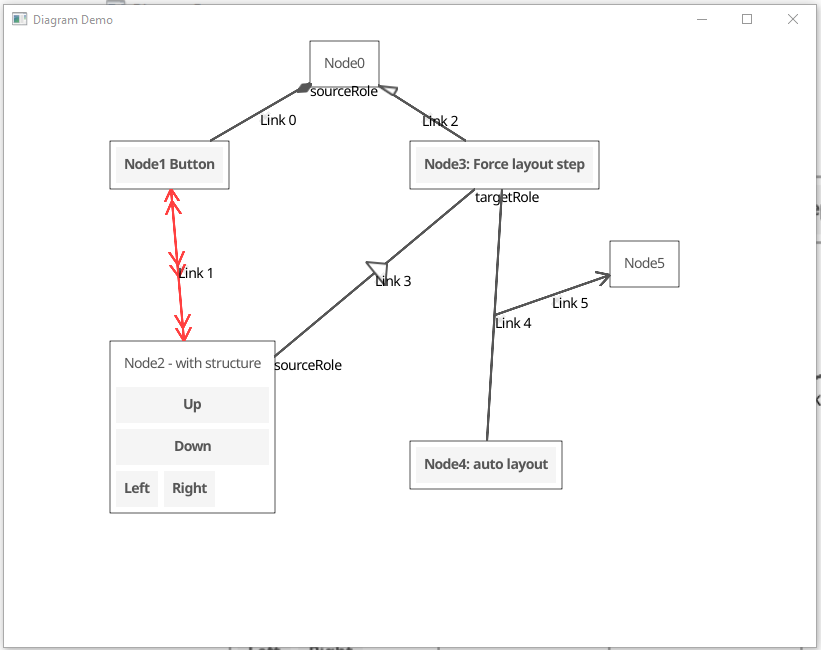

  
  
   
  
  
  

# DiagramWidget

The DiagramWidget provides a drawing area within which a diagram can be created. The diagram itself is a collection of 
DiagramElement widgets (an interface). There are two types of DiagramElements: DiagramNode widgets and DiagramLink widgets. 
DiagramNode widgets are thin wrappers around a user-supplied CanvasObject.
Any valid CanvasObject can be used. DiagramLinks are line-based connections between DiagramElements.
Note that links can connect to other links as well as nodes.

While some provisions have been made for automatic layout, layouts are for the convenience
of the author and are on-demand only. The design intent is that users will place the diagram elements for human readability. 

DiagramElements are managed by the DiagramWidget from a layout perspective. DiagramNodes have no size
constraints imposed by the DiagramWidget and can be placed anywhere. DiagramLinks connect 
DiagramElements. The DiagramWidget keeps track of the DiagramElements to which each DiagramLink 
is connected and calls the Refresh() method on the link when the connected diagram element is moved 
or resized. 

* [demo](../../cmd/diagramdemo/main.go)

  

## DiagramElement Interface

A DiagramElement is the base interface for any element of the diagram being managed by the 
DiagramWidget. It provides a common interface for DiagramNode and DiagramLink widgets. The DiagramElement
interface provides operations for retrieving the DiagramWidget, the ID of the DiagramElement, and
for showing and hiding the handles that are used for graphically manipulating the diagram element.
The specifics of what handles do are different for nodes and links - these are described below in the
sections for their respective widgets.

## DiagramNode Widget

The DiagramNode widget is a wrapper around a user-supplied CanvasObject. In addition to the user-supplied
CanvasObject, the node displays a border and, when selected, handles at the corners and edge mid-points 
that can be used to manipulate the size of the node. The node can be selected and dragged to a new position 
with a mouse by clicking in the border area around the canvas object. 

## DiagramLink Widget

The DiagramLink widget provides a directed line-based connection between two DiagramElements. 
The link is defined in terms of LinkPoints that are connected by LinkSegments (both of which
are widgets in their own right). The link maintains an array of points, with the point at index
[0] being the point at which the link connects to the source DiagramElement and the point at the 
last index being the point at which the link connects to the target DiagramElement. The link also
maintains an array of line segments, with the segment at index [0] connecting points [0] and [1], 
the segment at index [1] connecting the points [1] and [2], etc. The current implementation only
has a single segment, but interfaces will be added shortly to enable the addition and removal of
points and segments.

Many visual languages (formalized diagrams) utilize graphical decorations on lines. The link
provides the ability to add an arbitrary number of graphic decorations at three points along 
the link: the source end, the target end, and the midpoint. Decorations are stacked in the order
they are added at the indicated point. The location of the source and target points is obvious,
but the midpoint bears some discussion. If there is only one line segment, the midpoint is the
midpoint of this segment. If there is more than one line segment, the "midpoint" is defined to
be the next to last point in the array of points. For a two-segment link, this will be the point
at which the two segments join. For a multi-segment link, this will be the point at which the 
next-to-last and last segments join. Decorations can be added by calling 
`BaseDiagramLink.Add<position>Decoration(decoration Decoration)`. Two implementations of the Decoration 
interface are provided: An Arrowhead and a Polygon.

Also common in visual languages are textual annotations associated with either the link as a whole 
or to the ends of the link. For this purpose, the link allows the association of one or more 
AnchoredText widgets with each of the reference points on the link: source, target, and midpoint.
These widgets keep track of their position relative to the link's reference points. They can 
be moved interactively with the mouse to a new position. When the reference point on the link
moves, the anchored text will also move, maintaining its relative position. 

Users do not create AnchoredText widgets directly: the link itself creates and manages them. 
the user calls `BaseDiagramLink.Add<position>AnchoredText(key, text)` to add an anchored text. 
The key is expected to be unique at the position and can be used to update the text later. 
The AnchoredText can also be directly edited in the diagram.  

When a link connects to another link, it connects at the midpoint of the source or target link.

## Target Applications

Applications employing diagram-based user interfaces commonly have a core model (data structure), 
a tree view of the underlying model, one or more diagrams displaying subsets of the model, and 
a properties view of a single selected model elements. Desired application behavior is that 
model data may be edited in any of the views and changes are immediately reflected in the other views.

Mappings from model to diagram are more complex than simple bindings and typically require some 
type of mapping. A simple value in the model (e.g. a pointer from Element1 to Element2 in the model) 
may map to a graphical element (e.g. a link between graphical representations of Element1 and Element2). 
Simple bindings are not sufficient for this type of mapping. The DiagramElements employ 
application-provided unique identifiers (similar to those used in the Tree Widget) that provide 
a mechanism for correlating graphical and model elements. Callbacks on the DiagramWidget
(discussed below) provide the hooks for adding mapping behavior.

## DiagramWidget Architecture

The DiagramWidget manages a private drawing area inside a scrolling container and the DiagramElements
that appear in the drawing. These DiagramElements may be either Nodes or Links. The content of each 
node is an application-supplied canvas object that can be arbitrarily complex. Links are lines that 
can connect to both Nodes and other Links. 

All DiagramElements have default ConnectionPads to which links may connect, and these defaults may be 
augmented with application-supplied ConnectionPads at specific positions on the DiagramElement. The 
user interface mechanisms for interactively connecting Links to ConnectionPads are built into the 
DiagramWidget, with an application-provided callback `DiagramWidget.IsConnectionAllowedCallback()` 
determining which connections between links and pads are allowable.

Links can be customized with both graphical decorations and floating text annotations. Graphical 
decorations may be "stacked" at three locations on each link, either at the ends or the mid-point. 
An arbitrary number of floating text annotations can be added at each of these points as well. 
The position of each annotation with respect to the point may be adjusted by the user and the 
relative position will be maintained as the links are moved. The text in the annotations may be 
edited directly (an Entry widget is used for each annotation).

A number of callbacks on the DiagramWidget enable applications to add functionality.

* `DiagramWidget.LinkConnectionChangedCallback()` can be used to update application data structures when link connections are changed interactively.
* `DiagramWidget.LinkSegmentMouseDownSecondaryCallback()` can be used to provide context menus for links.
* `DiagramWidget.LinkSegmentMouseUpCallback()`

* `DiagramWidget.PrimaryDiagramElementSelectionChangedCallback()` can be used to notify the application that the graphical DiagramElement selection has changed.

There are a numer of callbacks for events directly in the drawing area:
* `DiagramWidget.MouseDownCallback()`
* `DiagramWidget.MouseInCallback()`
* `DiagramWidget.MouseMovedCallback()`
* `DiagramWidget.MouseOutCallback()`
* `DiagramWidget.MouseUpCallback()` can be used to complete a drag-and-drop operation adding a view of a data object to the diagram.
* `DiagramWidget.OnTappedCallback()' can be used to add new elements to a diagram based on a toolbar selection of element type.

## Extending a DiagramElement

DiagramElements can be extended by the application designer, but the initialization of the extension 
is slightly different than the normal fyne extension mechanism, The initialization function uses the 
normal fyne extension mechanism behind the scenes, but in addition initializes its relationship to the 
DiagramWidget to which it belongs, allowing the DiagramWidget to manage the DiagramElement. When the 
application designer extends diagram elements, they are expected to extend either `BaseDiagramNode` or 
`BaseDiagramLink` and call the appropriate initialization functions:
* `InitializeBaseDiagramNode(diagramNode DiagramNode, diagram *DiagramWidget, obj fyne.CanvasObject, nodeID string)`
* `InitializeBaseDiagramLink(diagramLink DiagramLink, diagram *DiagramWidget, linkID string)`
where diagramNode or diagramLink are the application-defined extensions.
