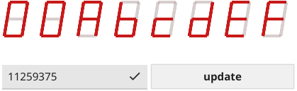
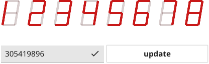

# Hex Widget

This widget implements a skeuomorphic "7 segment" hexadecimal display.

For an example of usage, see [the hexwidget demo](../../cmd/hexwidget_demo).

## Screenshots

## Future Work

* Support scaling the size of the hex widget.
* Support changing the hex widget color.
* Add a widget that combines multiple hex displays into a single *n*-bit number
  (where *n* is a multiple of 4).
